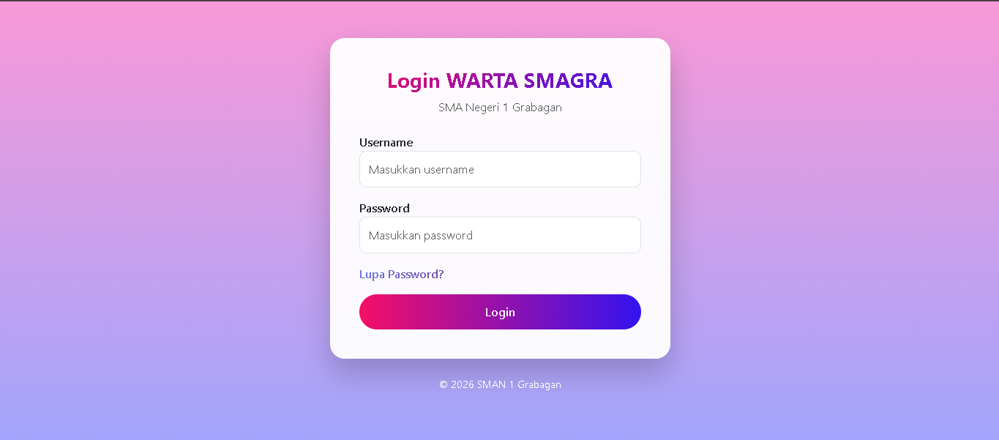
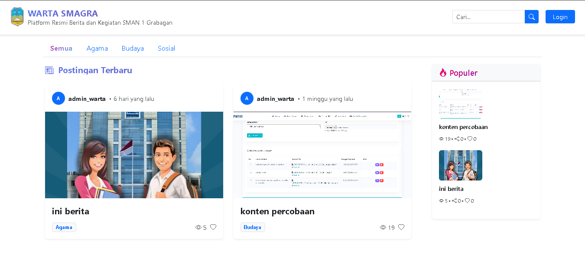
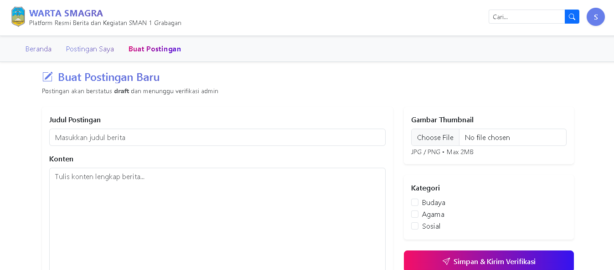
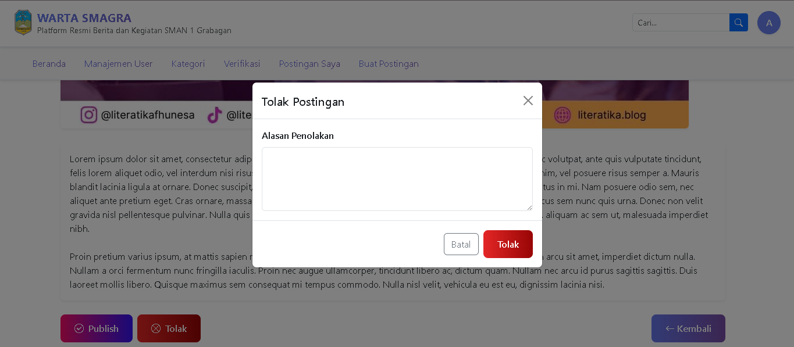

# WARTA – School News Portal

## Overview

WARTA is a web-based news portal developed for SMAN 1 Grabagan to facilitate the publication and dissemination of school-related information and news. The system provides a controlled content management workflow, ensuring that all published articles are reviewed and approved before becoming publicly accessible.

The platform supports administrators, registered school members, and public visitors through a role-based access system that maintains content quality and information reliability.

## Objectives

* Provide a centralized platform for publishing school news and announcements.
* Facilitate news submission by registered school members.
* Ensure content quality through an administrative verification process.
* Improve information dissemination within the school community.

## Features

### Public Access

* View published news articles without login.
* Browse news by category.
* Read article details and announcements.

### User Management

* User accounts are created and managed by administrators.
* Access is restricted to authorized school members.
* Secure authentication and login system.

### News Submission

* Registered users can create and submit news articles.
* Draft and pending article management.
* Article editing before publication.

### Content Verification

* Submitted articles enter a verification stage.
* Administrators review and approve submitted content.
* Only approved articles can be published and viewed publicly.

### Category Management

* Create, update, and delete news categories.
* Organize articles based on categories.

### Administrative Dashboard

* Manage users and roles.
* Manage news categories.
* Review submitted articles.
* Publish or reject articles.

## Workflow

1. Administrator creates user accounts.
2. Registered users log in to the system.
3. Users submit news articles.
4. Articles are reviewed by the administrator.
5. Approved articles are published.
6. Published articles become accessible to the public.

## Technology Stack

* Backend: Laravel
* Frontend: Blade Template Engine, Bootstrap
* Database: MySQL
* Authentication: Laravel Authentication
* Version Control: Git & GitHub

## System Screenshots

### Login Page

### Dashboard

### News Submission

### News Verification

## Development Role

This project was developed independently, covering:

* Requirement analysis
* Database design
* Backend development
* Frontend development
* Authentication and authorization
* News verification workflow implementation
* Testing and deployment

## Project Status

Completed.

## Author

Dina Hariyanti
